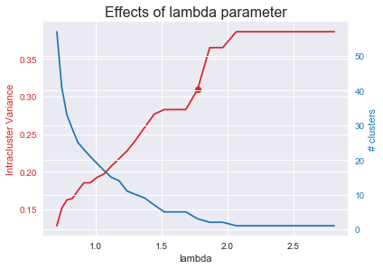

# lambda-means-clustering

This repository constains a very simple class cluster_dataset which provides functions for clustering data using lambda means clustering, predicting the cluster membership of previously unseen data, and for visualizing clusters in 2 dimensions by reducing data dimensionality with Linear Discriminant Analysis. It is pretty bare-bones as this was just a simple homeowrk assignment for a machine learning class.

## Datset 1
Dataset 1 is a dataset of 10-dimensional guassian distributions. There are 15 overall distributions that were used to make the dataset. Clustering with lambda means identifies 16 major clusters. Note that lambda means is susceptible to variations in clusters based on the ordering of data, which may account for this inaccuracy. Additionally, the optimal lambda parameter was selected simply by finding the highest second derivative of variance with respect to lambda and selecting this value as the hinge point or optimal lambda. More nuanced methods could yield a better selection of lambda.

  

## Dataset 2
Dataset 2 is a dataset of days of operation at a wastewater treatment plant, and the features are various measurable parameters from the plant. The dataset has missing vlaues which are filled in using the average value for that feature in this implementation. Again, perhaps 2 clusters would have been a better result than the 3 clusters output by lambda means.

 
